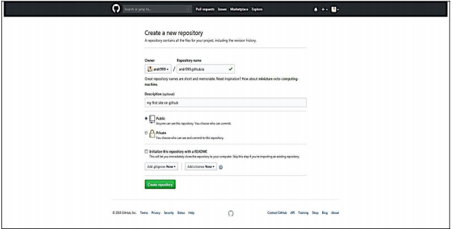
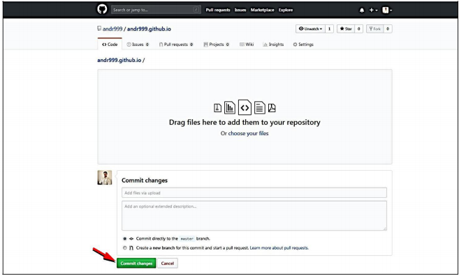

# My_website
#Welcom to this site.
Необхідно створити новий репозиторій таким чином, щоб він був
однаковим з вашим логіном та мав приставку github.io

Після цього потрібно завантажити файли вашого репозиторію,
натиснувши кнопку Upload files.

*I hope you have so much fun creating your website!**
*anne*
